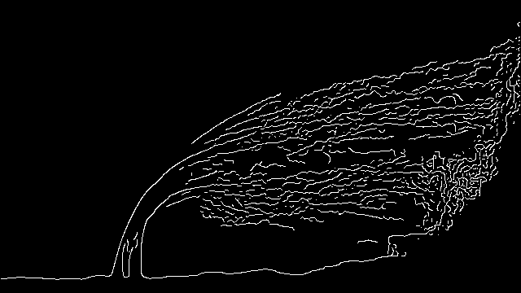
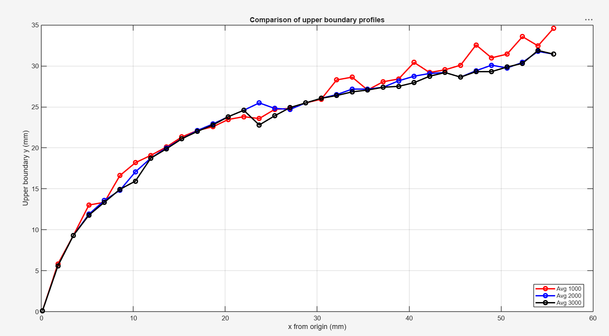

# spray-image-processing-matlab

MATLAB-based image processing and edge detection for experimental spray penetration analysis in supersonic crossflow studies.


## Project Overview

This project focuses on spray penetration analysis in supersonic crossflow using MATLAB-based image processing techniques.

The workflow includes:
- grayscale conversion,
- image binarization,
- image averaging,
- Canny edge detection,
- spray boundary extraction,
- penetration profile generation,
- and experimental data export.

The processed results were obtained from experimental spray images captured during liquid injection into supersonic crossflow conditions.


## Images and Processing Description

The uploaded images include:

- raw experimental spray images,
- averaged binary images,
- edge-detected spray boundaries,
- calibration images used for pixel-to-mm conversion,
- and penetration comparison plots.

Different Canny edge detection thresholds were tested to determine:
- better edge continuity,
- accurate spray boundary extraction,
- reduced noise effects,
- and reliable penetration profile detection.

The injector diameter with known physical dimensions was used for pixel calibration in order to convert image coordinates into physical dimensions (mm).


## Raw Experimental Dataset

The complete raw experimental image dataset can be accessed through the Google Drive link below:

[(https://drive.google.com/drive/folders/1kZqIiEn5slwM8AJ4aAb_qv5sQetPcFnr?usp=sharing)]

The drive folder contains:
- raw TIFF spray images,
- experimental frames used for averaging,
- calibration reference images,
- and additional processing datasets.


## Repository Structure

```text
spray-image-processing-matlab/

│── README.md
│── main.m

├── images/
│     ├── raw experimental images
│     ├── averaged binary images
│     ├── edge detection images
│     ├── calibration images

├── results/
│     ├── edge detection results
│     ├── penetration profile plots
│     ├── comparison graphs
│     ├── processed analysis outputs
│     ├── excel exported data
```


## Sample Results

### Averaged Binary Image


---

### Canny Edge Detection Result



---

### Penetration Comparison Plot



---

## MATLAB Techniques Used

- Image Averaging
- Binary Thresholding
- Canny Edge Detection
- Boundary Extraction
- Pixel-to-mm Calibration
- Data Export to Excel
- Experimental Spray Penetration Analysis

---

## Author

Rakuditi Sai Praneeth  
Mechanical Engineering Undergraduate  
National Institute of Technology Silchar

Research Interests:
- Computational Fluid Dynamics (CFD)
- Supersonic Flows
- Spray Dynamics
- Multiphase Flows
- Experimental Fluid Mechanics
- Image-Based Flow Diagnostics
